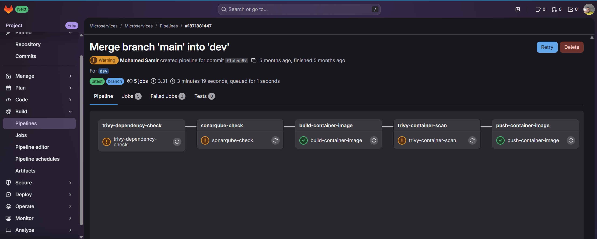
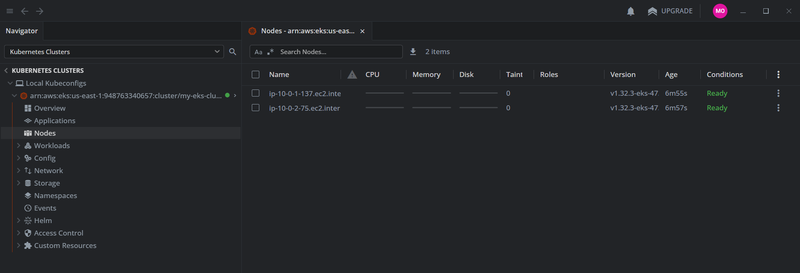
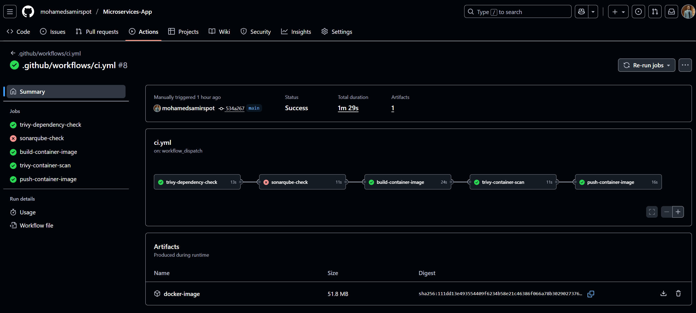

# Microservices Task

Note: Everything is in the same repo, of course it's preferable to separate the infrastructure part to be in another repo, but for simplicity while reviewing the task, everything is in the same repo.

## Infrastructure Installation (Terraform)

Running the terraform manifests that will create the following components in aws (terraform will use my aws credentials from my local creds)
- vpc
- subnets
- eks cluster with karpenter (optional usage) restricted from my ip only

```bash
terraform init
terraform apply
aws eks --region us-east-1 update-kubeconfig --name my-eks-cluster
```



## Applying K8s Manifests

These kubernetes manifests will create the following:
- Deployment (for the app)
- Load Balancer Service
- the required gitlab kubeconfig for rolling out deployments (service account, clusterrole, clusterrolebinding, secret token)
- eks cluster with karpenter (optional usage)
```bash
kubectl apply -f ./k8s-manifests/.
```

