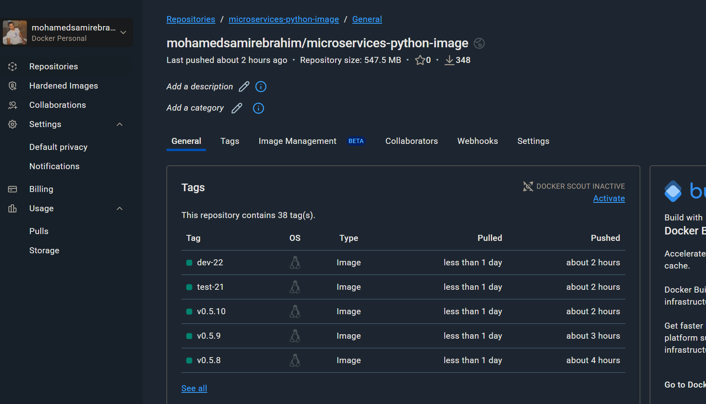
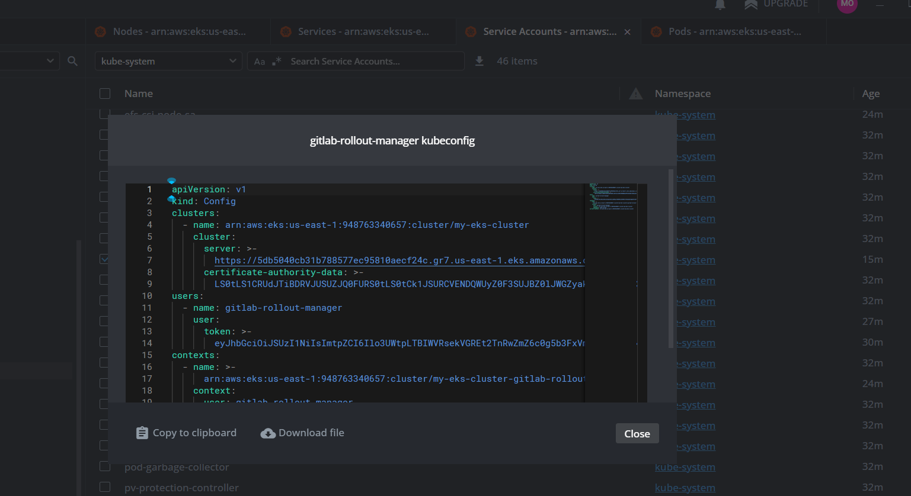
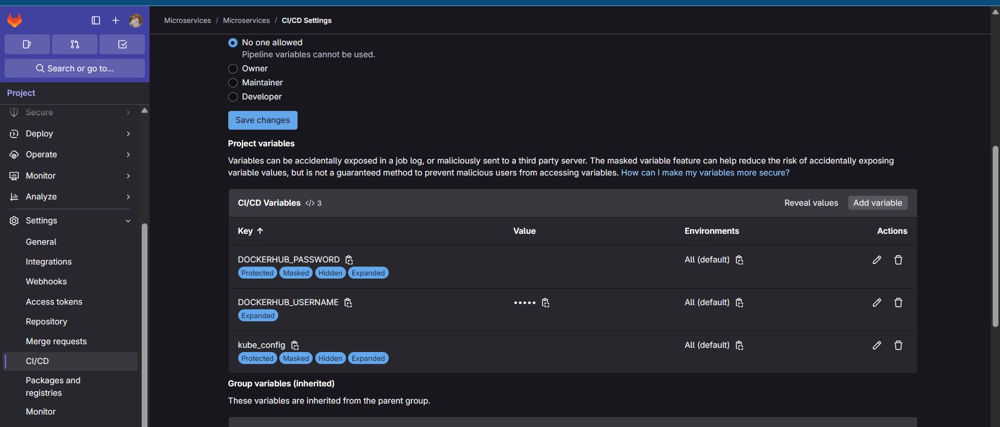
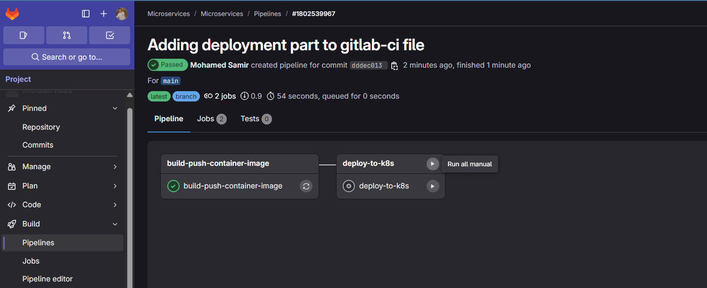

# Microservices Task

Note: The Arogcd Manifests Repo: https://gitlab.com/microservices6813119/microservices-k8s-manifests

## Infrastructure Installation (Terraform)

Running the terraform manifests that will create the following components in aws (terraform will use my aws credentials from my local creds)
- vpc
- subnets
- eks cluster with karpenter (optional usage) restricted from my ip only

```bash
terraform init
terraform apply
aws eks --region us-east-1 update-kubeconfig --name my-eks-cluster
```


## Applying K8s Manifests

These kubernetes manifests will create the following:
- Deployment (for the app)
- Load Balancer Service
- the required gitlab kubeconfig for rolling out deployments (service account, clusterrole, clusterrolebinding, secret token)
- eks cluster with karpenter (optional usage)
```bash
kubectl apply -f ./k8s-manifests/.
```

## Configuring Gitlab CI/CD Part

- Creating the image repo in dockerhub
- Extracting the gitlab runner kubeconfig from the cluster and converting it to base64
- Creating dockerhub username and password and gitlab rollout kube_config hidden variables in gitlab itself




## Pipeline
- as you can see the deployment stage is waiting for manual trigger
