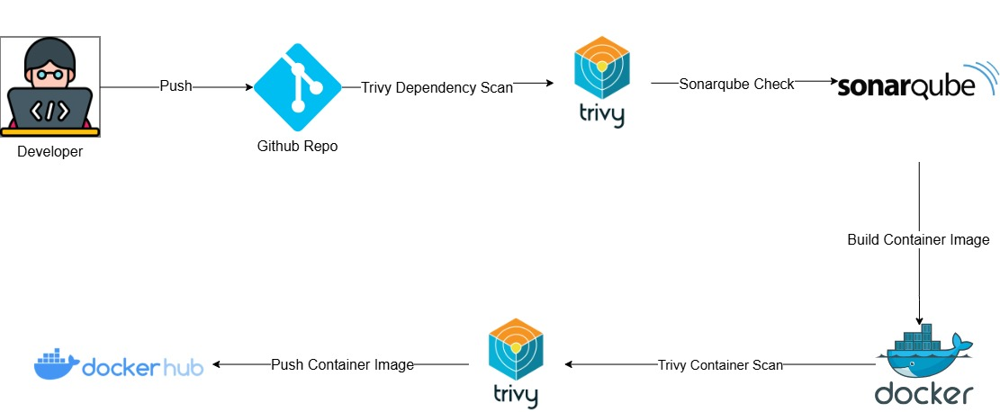

# Microservices Task

- The Infrastructure (terraform) Repo: https://github.com/mohamedsamirspot/Microservices-Infrastructure
- The Arogcd Manifests Repo: https://github.com/mohamedsamirspot/Microservices-K8s-Manifests

## Cicd (Gitlab-Ci or Github Actions)

This CICD Pipeline does the following:
- trivy-dependency-check
- owasp-dependency-check (optional)
- sonarqube-check
- build-and-trivy-scan-container-image
- push-container-image to docker hub
- Optional: build in multiarch (amd and arm)

### Gitlab

### Github Actions

### Dockerhub

### App

