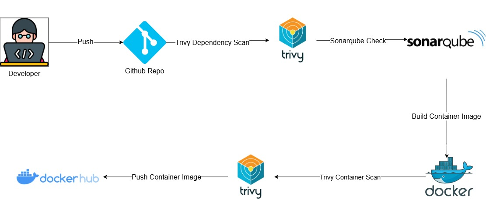
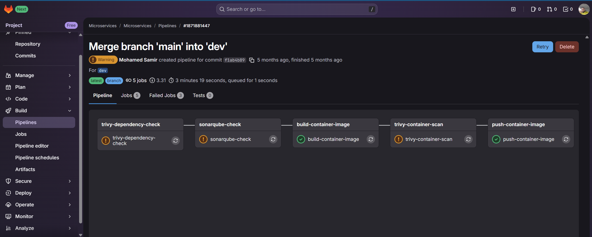
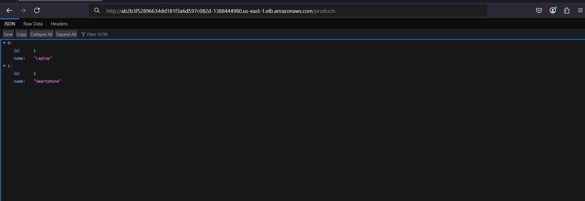
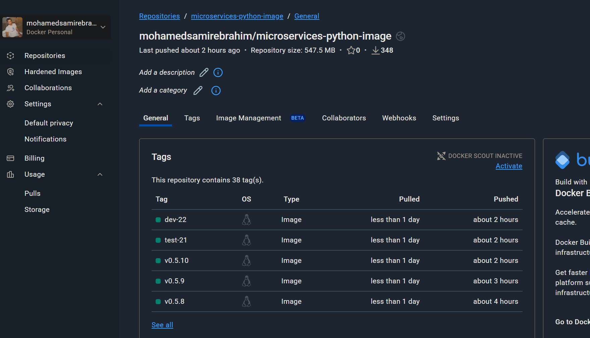
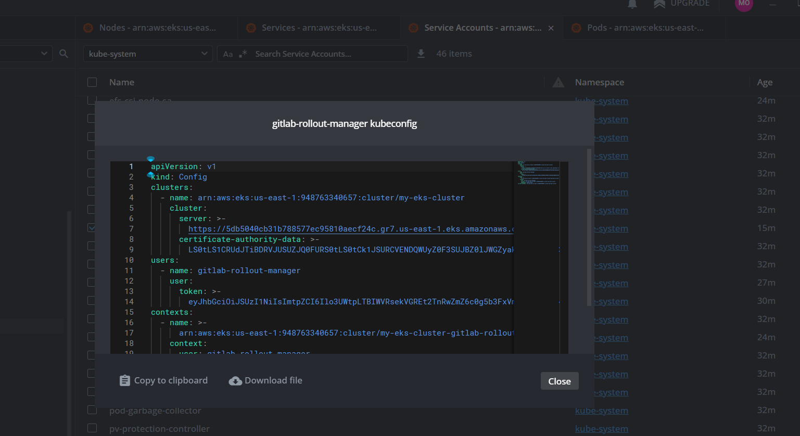

# Microservices Task

- The Infrastructure (terraform) Repo: https://github.com/mohamedsamirspot/Microservices-Infrastructure
- The Arogcd Manifests Repo: https://github.com/mohamedsamirspot/Microservices-K8s-Manifests

## Cicd (Gitlab-Ci or Github Actions)

This CICD Pipeline does the following:
- trivy-dependency-check
- owasp-dependency-check (optional)
- sonarqube-check
- build-and-trivy-scan-container-image
- push-container-image to docker hub
- package and push the Helm chart to the DockerHub OCI registry for release tags
- Optional: build in multiarch (amd and arm)

## Release packaging

The app release artifact is composed of:
- Docker image: `ghcr.io/mohamedsamirspot/microservices-app:vX.Y.Z`
- Helm chart: `ghcr.io/mohamedsamirspot/microservices-app:X.Y.Z`

The Helm chart lives in `charts/microservices`. The release workflow packages it with `Chart.version=X.Y.Z` and `Chart.appVersion=vX.Y.Z`, so the chart deploys the matching image by default.

Promotion to the GitOps repo is intentionally skipped for now. A later workflow can update dev/prod Argo CD Applications after the image and chart are published.

### Gitlab

### Github Actions

### Dockerhub

### App

